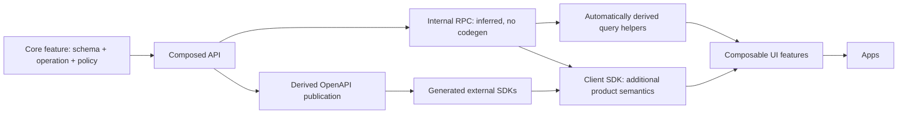

# A product is a function of its API

Draft 0.6 reflects Fernando's corrections: **colocate by feature, define operations once, derive the consumption surfaces, and keep callers small.** Effect RPC and Effect Schema are the selected direction. The focused executable enforcement profile accompanies these conventions.

## Overall goals

Given the SDK, someone should be able to build another client without knowing how the original app works. The public SDK is a complete, discoverable, extensible product interface: one consumable whole, implemented in feature-local modules. Swift apps, Next.js apps, CLIs, and MCP servers are all first-class consumers of the same API contract.

Treat packages as independently consumable, potentially publishable npm packages. Publication is not a commitment; it is a design test. Apps depend on packages as sources of truth. Neither missing app helpers, private source imports, nor workspace-only aliases should be needed by a new consumer.

Define each public data contract once as a runtime schema, normally in the owning feature's `api/` area. Derive types and mechanical clients from it. Consumer type safety and speed are both requirements: measure IDE/typecheck cost as the API grows, alongside bundles, startup, requests, and streams. Never trade away inference to `any` to hide a scaling problem.

Make those derived types easy to consume: `InputOf<typeof query.users.byId>`, `OutputOf<typeof query.users.byId>`, and `ResourceOf<typeof query.users.byId>` should work directly, including the equivalent `getOptions` factory view. Consumers derive from the operation already in front of them, without creating payload/resource interfaces or repeating TypeScript plumbing. [Public type-helper examples](../skills/fernando-product-engineering/references/client-sdk.md#derive-types-from-the-operation-in-front-of-you).

For AI coding agents, distinguish the client host, orchestration host, and tool-execution host. Bind local or sandbox execution at the authorized composition root; transport and tool placement are separate decisions. [Harness examples](../skills/fernando-product-engineering/references/runtimes.md).

Custom lint and graph checks enforce the configured boundaries; contract and behavioral tests cover properties lint cannot prove. The focused executable profile now ships with the skill; see the [implemented scope and remaining roadmap](../skills/fernando-product-engineering/references/enforcement.md#executable-adoption-profile). A passing profile does not establish the entire architecture or replace product lifecycle fixtures.

For React work, always consult the composition skill's relevant guidance. New React apps use modern React with React Compiler; CI runs compiler diagnostics and the compiler-enabled build. Web apps also receive hard build/startup budgets, with X seconds configured per repo and explicit readiness/cache conditions. See [React guidance](../skills/fernando-product-engineering/references/react.md) and [CI budgets](../skills/fernando-product-engineering/references/enforcement.md#web-build-and-dev-startup-budgets).

## Dependency injection across the stack

Dependency injection is a foundational design pattern supporting these goals. Consumers describe required capabilities; composition roots choose implementations and manage their lifetime. React context providers, Effect service dependencies supplied by layers, and SDK transport/execution bindings apply that same principle at different boundaries. The consuming feature or service should not need to know which implementation supplied its contract.

Use the nearest boundary that owns the decision: a React subtree, an API request, a client instance, or a worker host. Tests supply alternate implementations through the same boundary. Ordinary function arguments are sufficient for simple cases; avoid adding containers, per-function factories, or duplicate interfaces merely to demonstrate dependency injection.

## The source of truth

Start with the consumer's desired call and component tree. Define the runtime input, output, error, and stream schemas beside the feature that owns the operation. Bind them to its API declaration once. Infer everything mechanical from the composed API: internal RPC methods, static types, query options, and the published OpenAPI representation.

Use the [vertical-slice build sequence](../skills/fernando-product-engineering/references/build-sequence.md) to implement that design from core through SDK and UI. It applies to the first greenfield slice and each subsequent feature, with reuse of unchanged layers and explicit integration checkpoints.



These arrows show derivation and consumption. They do not require a runtime import of server handlers into the browser. The server Api is referenced with `import type`. Effect separately imports a safe runtime RPC/schema barrel for codecs; implementations, DB access, credentials, and live layers remain behind server entry points.

For new API-bearing features, expand the API area to `core/src/features/<feature>/api/{schema,rpc,index}.ts`. This is feature-owned API code; the top-level `packages/api` composes it. `api/index.ts` is the mounted binding role previously written as `api.ts`. Services import `api/schema.ts` directly, never the server binding barrel, so schema ownership introduces no dependency cycle.

There is **no global contracts package or contracts directory**. `schema.ts` or `contract.ts` can live inside a feature alongside the code it describes. Sharing a schema means importing its owner's public schema entry point, not moving it into a miscellaneous shared-types bucket.

## Colocation and boundaries

Packages represent ownership, consumers, privileges, or runtimes. Within them, organize by product feature first. Do not create `schemas/users.ts`, `services/users.ts`, `hooks/users.ts`, or `react-query/users.ts` collections merely because the files share a code type.

| Boundary | Owns |
| --- | --- |
| Libraries / DS | Generic owned dependencies and platform implementations |
| Core | Feature-local schema, DB, authorized service, wire RPC declaration, and server API binding |
| API | Composition/mounting of core feature APIs, host/auth integration, derived publication |
| RPC | Internal client inferred from the API; browser/server transport binding and generic query integration |
| SDK | Generated external distribution from OpenAPI when needed; not an intermediate step for internal TypeScript clients |
| Client SDK | Complete root `createClient()` product interface, semantic helpers, and one optional `./react` surface |
| UI features | Headless interfaces, data/state/action hooks, provider implementers, components, and screens, colocated by feature |
| Apps | Thin UI entry points and explicit backend/host mounts |

These remain logical boundaries even when a small product uses fewer packages. `core/features/chat` is the backend/domain feature; `features/chat` is its portable UI composition. Avoid adding another factory or package merely to repeat an existing interface.

## Proposed tree

```text
packages/
  libraries/src/
    effect/                    # named owned Effect/Schema/RPC APIs
    query/                     # generic query/provider infrastructure
    navigation/                # generic router adapters
  design-system/src/
    index.ts                   # vanilla tokens only
    react/index.ts             # explicit component barrel
    button/
      contract.ts
      index.tsx
      index.native.tsx
  core/src/features/
    users/
      api/
        schema.ts              # only definition of user/input/output/error shapes
        rpc.ts                 # client-safe wire declaration using the schemas
        index.ts               # server binding from wire contract to service
      service.ts               # implementation, inferred inputs/results
      db.ts                    # private persistence
      index.ts                 # deliberate ESM exports, server surface
    chat/
      api/
        schema.ts
        rpc.ts
        index.ts
      service.ts
      db.ts
    deployments/
      api/
        schema.ts
        rpc.ts
        index.ts
      service.ts
  api/src/
    index.ts                   # server handler/lifecycle + exported Api type
    rpc/index.ts               # explicit client-safe aggregate runtime group
    live.ts                    # combines feature APIs and dependencies once
    hosts/
      internal.ts
      external.ts
    next/index.ts              # explicit Next adapter, optional peer
    bun/index.ts               # explicit Bun runtime adapter
    openapi.ts                 # generic publication projection, no DTO copies
  rpc/src/
    index.ts                   # public inferred transport/type barrel
    types.ts                   # import type { Api }, no server runtime import
    client.ts                  # browser/native binding
    server.ts                  # server binding, no app-specific globals
  sdk/src/generated/           # external OpenAPI client output when needed
  client-sdk/src/
    index.ts                   # public root: createClient + consumer types
    client.ts                  # private whole-product instance implementation
    react/
      index.ts                 # public React/query barrel
      query.ts                 # private generic options integration
      provider.tsx             # client-only leaf for SDK injection
    features/
      chat/
        stream.ts
        react.ts               # only if a hook adds a useful contract
      deployments/
        display.ts
  features/src/
    index.ts                   # vanilla exports only
    chat/
      react/index.ts           # public React feature barrel
      composer/
        schema.ts
        contract.ts
        context.tsx
        use-composer.ts         # React state/actions; calls vanilla SDK logic
        input.tsx
        submit.tsx
        frame.tsx
        index.ts
        providers/
          new.tsx
          existing.tsx
          forward.tsx
      messages/
        list.tsx
        item.tsx
      panels/
        contract.ts
        context.tsx
        root.tsx
        panel.tsx
      screens/
        new.tsx
        existing.tsx
        mobile.tsx
      next/
        page.tsx
      rsc/
        prefetch.tsx            # only if a feature needs its own wrapper
    app/
      next/
        provider.tsx           # mounts provider according to official docs
        request.ts             # request-local binding, shared across pages
        prefetch.tsx           # reusable convenience around documented hydration
apps/
  web/app/
    layout.tsx
    chat/[id]/page.tsx
    api/[...path]/route.ts
  native/src/
    index.ios.tsx
    index.android.tsx
tooling/
  eslint/
  boundaries/
```

Do not scaffold every listed file. A small feature may keep schema and operation together. Split a file when it separates a real ownership/runtime boundary or improves reading, not to satisfy a universal file-count convention.

## Internal RPC is mandatory and inferred

The internal TypeScript path is `API → inferred RPC`, with no generation step and no handwritten `TransportSdk`, `ProductClient`, or per-domain method mirror. With Effect RPC, the group supplies payload/success/error types to handlers and to `RpcClient.make`. The RPC package owns connection/runtime configuration once. It does not manually restate `users`, `chat`, and every operation.

React Query option helpers are likewise derived in one generic integration, rather than a `createUserQueries` function for every domain. The desired call site is:

```tsx
import { createClient } from '@example/client-sdk'
import { createQuery } from '@example/client-sdk/react'

const client = createClient({ baseUrl: '/api/rpc' })
const query = createQuery(client)
// A feature-local hook consumes these options internally.
// UI components consume useUserById({ id }) or its provider contract.
```

Client/query construction happens once at the appropriate composition root; features receive it through the SDK provider. That query helper shape is a proposed owned integration, not a claim that Effect ships TanStack helpers. Implement or select the generic integration once. Per-operation metadata such as read/mutation/stream classification belongs beside the original API declaration; do not infer it from method spelling or keep a second operation catalog.

QueryClient setup invokes one `setMutationDefaults(client)` installer from `client-sdk/react` before mounting consumers. It centralizes mutation invalidation and reconciliation through feature-local policies; individual hooks do not repeat or override them. Module-defined factories retain browser lifetimes and isolate server clients.

Components consume hooks and compose UI; important state/action coordination lives in feature-local hooks. Those hooks own query/mutation/subscription usage. Query hooks use a narrow type projection; mutation hooks return the complete inferred `useMutation` result. React Query is a chosen core primitive of the React layer, so replacing it may require adapting that contract or updating consumers. Transport changes can still happen beneath it. Query hooks preserve tracked result objects with a type-only public projection; eager normalization is not the default. Suspense hooks are an explicit alternative with different pending/error-boundary requirements. A provider can own the hook when several parts need shared state or one subscription lifetime. Product rules and transformations remain in the vanilla SDK/core, so moving them into a React hook does not make them the React client's private responsibility. [Concrete hook/provider examples](../skills/fernando-product-engineering/references/react.md#components-consume-hooks-hooks-adapt-the-sdk).

OpenAPI is another projection of the same source. Effect RPC does not supply a built-in complete REST/OpenAPI exporter; the generic projection into an HTTP/OpenAPI surface is still implementation work. Put required method/path/status metadata with the operation once, and reference the same schema objects. Do not solve a missing exporter by maintaining a second set of domain shapes or silently dropping the requirement.

## Schema, DB, service, API

The `schema → db → service → api` responsibility order remains. In the expanded feature layout, `api/schema.ts` defines public data, `api/rpc.ts` associates those schemas with wire operations, and `api/index.ts` binds authorized services. A `RpcGroup.make(...)` declaration alone is not the mounted implementation. Each domain service exports one named class, such as `UsersService`, whose static methods return Effects with injected dependencies. The API binds `UsersService.getById` directly; no parallel standalone function exports. The coherent service surface can accept a method-level tree-shaking cost, while browser graphs exclude services entirely.

```text
users/
  api/schema.ts    <- service imports these types directly
  api/rpc.ts       -> imports schema; no service/DB import
  api/index.ts     -> imports rpc + service; mounts authorized implementations
  service.ts       -> imports schema + DB capability + policy
  db.ts            -> private scoped persistence
```

This is responsibility layering, not a required linear import chain. Declaration leaves never import live bindings. No DTO shape is repeated. The compact `schema.ts`/`rpc.ts`/`api.ts` examples elsewhere are equivalent; expanding a feature into `api/` moves its schema instead of copying it.

Client type inference uses `import type { Api } from '@example/api'`. Effect's standard `RpcClient.make` separately takes a real `ApiRpc` value from `@example/api/rpc` to encode/decode. Erasing that value would break the client. The public wire barrel contains no handlers, credentials, or server dependency layers. [Effect RPC client](https://github.com/Effect-TS/effect/blob/v3/packages/rpc/src/RpcClient.ts).

## Fewer factories

Effect dependency layers provide repository/policy/execution capabilities at the host boundary. Handler implementations are checked against the API group. Core functions infer their return type; input types derive from the owning schema. No parallel service interface and `createXService` are required merely to make something callable.

A factory is appropriate for a real runtime resource or independent instance. It should not appear repeatedly in feature or page consumption just to reconstruct the API. A page does not assemble a transport, product client, domain namespace, query factory, and query cache from scratch. A single root `createClient` at the app/request boundary is appropriate instance construction; it exposes the whole product.

## React Query and Next.js

The authoritative implementation instructions are the official [TanStack Advanced Server Rendering guide](https://tanstack.com/query/latest/docs/framework/react/guides/advanced-ssr), specifically provider setup and streaming sections. Read them for the installed version before implementing the adapter. Use Next's [SPA guide](https://nextjs.org/docs/app/guides/single-page-applications) as host context.

Our policy adds owned imports, inferred API options, and optional hydration. It does not replace the documented provider lifecycle with a homemade framework. The provider lives behind an owned integration, uses the documented server/browser QueryClient lifetime, and the same cache that starts prefetching must be dehydrated. Details and a short adapter example are in [platforms](../skills/fernando-product-engineering/references/platforms.md).

The proposed shared prefetch API accepts a batch setup callback:

```tsx
<Prefetch query={async ({ client, query }) => {
  void client.prefetchQuery(query.chat.byId.getOptions({ id }))
  void client.prefetchQuery(query.chat.messages.getOptions({ chatId: id }))
}}>
  <ExistingChatRoot chatId={id} />
</Prefetch>
```

Here `client` is the QueryClient and `query` is the inferred product query interface. The wrapper invokes the callback without awaiting, then dehydrates the same client with pending queries included. The callback registers queries synchronously before yielding; data prefetches remain pending. Never await setup or data at the top-level RSC shell. Required async key inputs resolve in a child beneath Suspense, preserving SPA-first instant navigation and partial prerendering. This is an owned convenience over the official hydration recipe, not a different provider mounting system.


## Vanilla package defaults

Every root import is framework-independent. Put integration code in explicit folders and slash exports: `rpc/react`, `client-sdk/react`, `api/next`, and `api/bun`. Apply this to UI packages too: `design-system/react` for components and `features/chat/react` for a React composition. Vanilla roots must not re-export these adapters or leak their types.

Framework-specific peers are optional for the base package and required only by consumers of the corresponding adapter. Declare that through peer metadata, then test root imports without the peer installed; a slash export by itself does not make eager dependencies optional. Bun remains a runtime requirement for its adapter. [Manifest and import recipes](../skills/fernando-product-engineering/references/recipes.md#3-package-exports-and-optional-peers).

Provider wrappers also own their individual state hooks. `ChatWorkspaceProvider` composes `ChatWorkspacePanelsProvider` and `ChatWorkspaceComposerProvider`; it does not subscribe to both state sources itself. [Provider recipe](../skills/fernando-product-engineering/references/recipes.md#25-each-provider-owns-its-own-state-hook).

## Public barrels and complete client instances

```ts
// chat/composer/index.ts
export { ComposerFrame as Frame } from './frame'
export { ComposerInput as Input } from './input'
export { ComposerSubmit as Submit } from './submit'

// chat/index.ts
export * as Composer from './composer'
```

Package export maps expose only approved root/named barrels and import rules block all private/source/deep-path bypasses. Client SDK defaults to `.` and `./react`. Internal cross-package runtime distinctions can justify explicit additional barrels, such as `@example/api/rpc`.

Callers still get `Composer.Frame`. Use named exports, `export *`, and `export * as` to compose **owned public modules**, with no duplicated symbol registrations in `export const Composer = { ... }`. Vendor wildcard exports remain prohibited. Keep server/client entry points separate and verify tree shaking in the selected bundler; namespace syntax permits static analysis but does not prove every dynamic access pattern or module side effect is removable.

## Decisions to review

| Decision | Current position |
| --- | --- |
| Schema/backend | Effect RPC + Effect Schema, selected by Fernando |
| Organization | Feature first; schemas and operations colocated in core features |
| Internal client | Dedicated inferred RPC package, no codegen |
| Client SDK | Root `createClient()` returns the whole product; optional `./react` exposes one query interface |
| Query integration | `query.users.byId.getOptions({ id })`, automatically derived |
| API file role | Feature `api/index.ts` binds services; `api/schema.ts` and `api/rpc.ts` are declaration leaves. Flat `api.ts` remains equivalent. |
| Package default | Vanilla root; explicit adapter folders/slash barrels; optional framework peers |
| Provider state | Separate subscribing wrapper per provider; parent composes children only |
| Import boundary | Server Api is type-only; Effect runtime wire schemas use one approved safe barrel |
| Next integration | Official TanStack provider/hydration recipe, wrapped once |
| Exports | ESM named/star/namespace exports over owned public modules |
| Still to prove | Exact Effect version, generic query integration, single-source HTTP/OpenAPI projection, generated streaming clients, bundle behavior |

Next, validate one operation through the selected Effect versions and the inferred client. Adding a second operation must require only its owner-local declaration/implementation and ordinary group composition; all internal client methods/types and mechanical query options must follow automatically.
